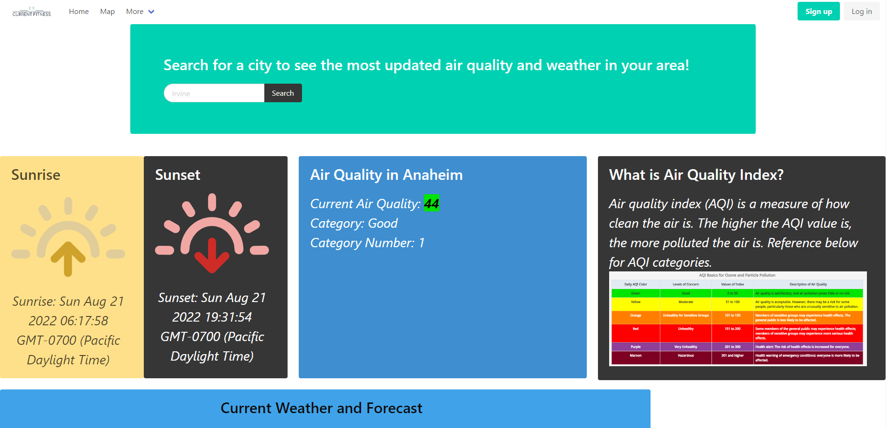
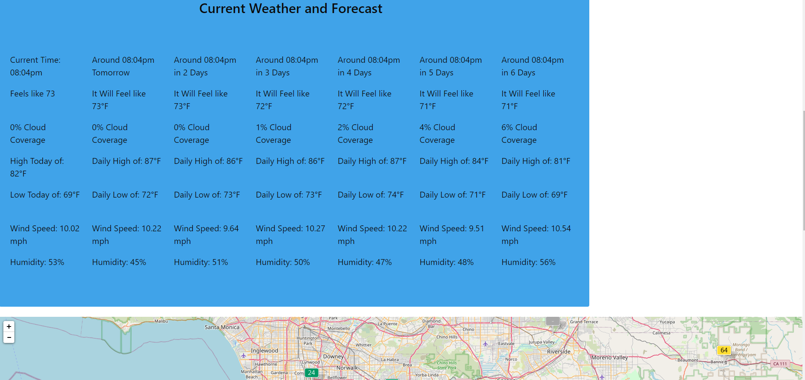
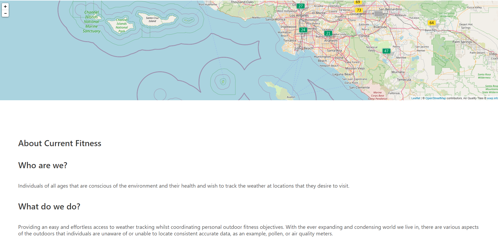
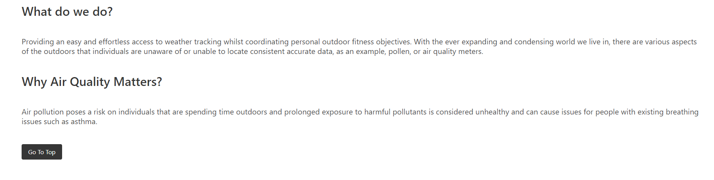

# Current Fitness

## NOTE: please use your own API keys (3 different keys needed; See API Links below) and create a config.js file. Refer to sampleconfig.js for how to set up the API Keys.

In this application, you will find a site that displays current air quality and weather for users looking to plan an outdoors workout. The user can search for a city and the current air quality and weather coditions plus a 7-day weather forecast is shown. In addition, a map widget is displayed and shows the air quality for the searched city plus the neighboring cities.

The air quality includes an index that is color coded in accordance to the EPA air quality index system. Also, when the user searches for a city, that city will be stored locally (client side). If the user navigates away from the site and then returns, the air quality and weather for the last searched city is saved and displayed. 

----
## [Link to Depolyed Application](https://enigmakontrol.github.io/Current_Fitness/)

----
----
## [Link to Code on GitHub](https://github.com/EnigmaKontrol/Current_Fitness)
----
----
## 
## 
## 
## 
----
----
# API Links
## [Link to EPA AirNow API](https://docs.airnowapi.org/)
## [Link to AQICN API](https://aqicn.org/links/)
## [Link to OpenWeather API](https://openweathermap.org/api/one-call-api)

